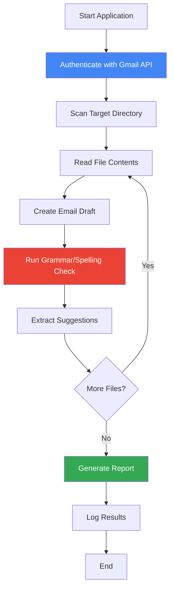
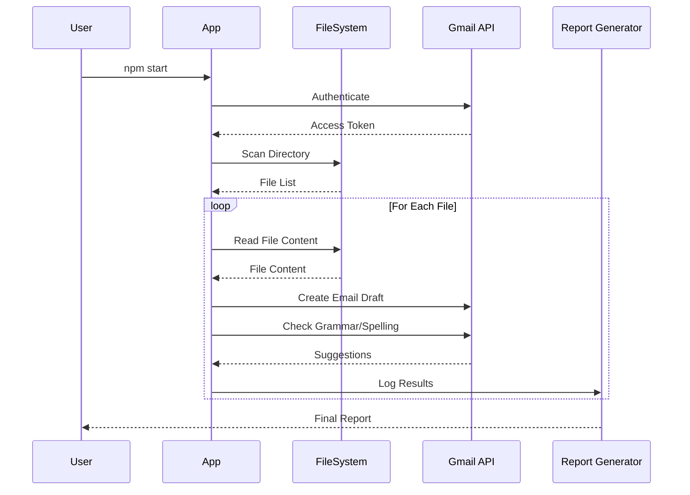

# Gmail Detector - Grammar & Spelling Checker

A Node.js application that leverages Gmail's grammar and spelling detection capabilities to scan files and identify writing errors. The tool automatically creates email drafts with file contents, extracts grammar/spelling suggestions, and generates comprehensive reports.

Built in 2021. This Node.js application integrates with Gmail API to provide automated grammar and spelling checking for local files.

## Features

- 📧 Gmail API integration for authentication
- 📁 Scans files from specified directories
- ✍️ Creates email drafts with file contents
- ✅ Detects grammar and spelling mistakes
- 💡 Extracts recommended corrections
- 📊 Generates detailed logs and reports
- 🔄 Automated batch processing

## Architecture



## Workflow Diagram



## Getting Started

### Prerequisites

- Node.js (v12 or higher)
- npm
- Gmail account (dummy account recommended)
- Google Cloud Project with Gmail API enabled

### Installation

1. Clone the repository:
```bash
git clone https://github.com/orassayag/gmail-detector.git
cd gmail-detector
```

2. Install dependencies:
```bash
npm install
```

3. Set up Gmail API credentials:
   - Create a project in [Google Cloud Console](https://console.cloud.google.com/)
   - Enable the Gmail API
   - Create OAuth2 credentials
   - Download and configure credentials

### Configuration

Configure the application settings:
- Set source directory path for files to check
- Define file extensions to scan
- Configure output directory for logs
- Set up Gmail API credentials path

### Running the Application

Start the grammar/spelling checker:
```bash
npm start
```

The application will:
1. Authenticate with Gmail
2. Scan the configured directory
3. Process each file
4. Create email drafts
5. Extract grammar/spelling suggestions
6. Generate a comprehensive report

## Project Structure

```
gmail-detector/
├── misc/
│   ├── backups/         # Code backups
│   └── documents/       # Project documentation
│       ├── todo_tasks.txt        # Planned features
│       ├── complete_tasks.txt    # Finished tasks
│       ├── finalize_tasks.txt    # Pre-release checklist
│       └── error_index.txt       # Error codes reference
├── CONTRIBUTING.md      # Contribution guidelines
├── INSTRUCTIONS.md      # Detailed setup and usage
├── LICENSE             # MIT License
└── README.md           # This file
```

## Error Codes

All errors include a unique serial number (starting from 1000000) for easy identification. See `misc/documents/error_index.txt` for the complete error code reference.

## Development Status

This project is in the planning/early development phase. See `misc/documents/todo_tasks.txt` for planned features:

**Planned Features:**
- [ ] Copy code from 'udemy-courses' project
- [ ] Set up Gmail account integration
- [ ] Implement file scanning functionality
- [ ] Create email draft generation
- [ ] Extract grammar/spelling suggestions
- [ ] Implement logging and reporting

## Development

The project follows these principles:
- Clean, simple, and readable code
- Clear and consistent naming conventions
- Modular code structure
- Comprehensive error handling with unique error codes
- Well-documented code with explanatory comments

### Maintenance Workflow

Before making changes:
1. Create a backup (`npm run backup` or manually)
2. Review maintenance checklist

After making changes:
1. Verify everything works
2. Update documentation if needed
3. Commit and push to Git
4. Update external backups

## Contributing

Contributions to this project are [released](https://help.github.com/articles/github-terms-of-service/#6-contributions-under-repository-license) to the public under the [project's open source license](LICENSE).

Everyone is welcome to contribute. Contributing doesn't just mean submitting pull requests—there are many different ways to get involved, including answering questions and reporting issues.

Please feel free to contact me with any question, comment, pull-request, issue, or any other thing you have in mind.

See [CONTRIBUTING.md](CONTRIBUTING.md) for detailed contribution guidelines.

## Author

* **Or Assayag** - *Initial work* - [orassayag](https://github.com/orassayag)
* Or Assayag <orassayag@gmail.com>
* GitHub: https://github.com/orassayag
* StackOverflow: https://stackoverflow.com/users/4442606/or-assayag?tab=profile
* LinkedIn: https://linkedin.com/in/orassayag

## License

This application has an MIT license - see the [LICENSE](LICENSE) file for details.

## Acknowledgments

- Inspired by the need for automated grammar and spelling checking
- Leverages Gmail's powerful language detection capabilities
- Built with Node.js and Gmail API
